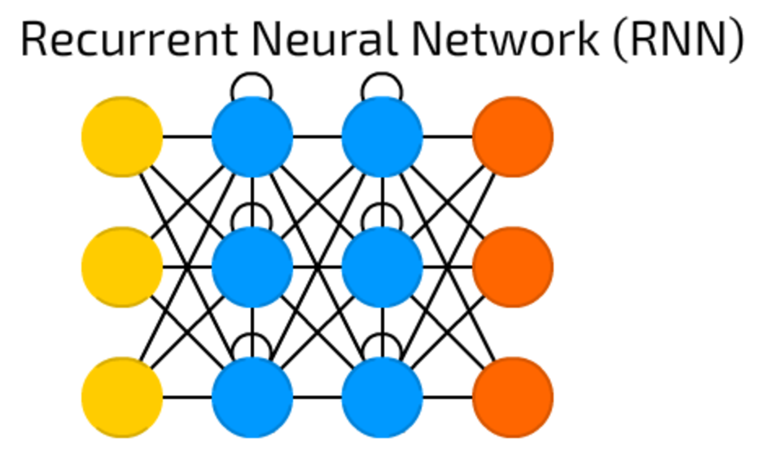

# Sentiment-Analysis-Using-SageMaker

  
   

Analyzing the sentiment of movie reviews using recurrent neural networks (RNN) and the deployment platform is the Amazon SageMaker. The deployed RNN performs sentiment analysis on movie reviews complete with publicly accessible API and a simple web page which interacts with the deployed endpoint. The full detailed report with the documented code is available in [pdf](report..pdf) or [html](report.html). 
